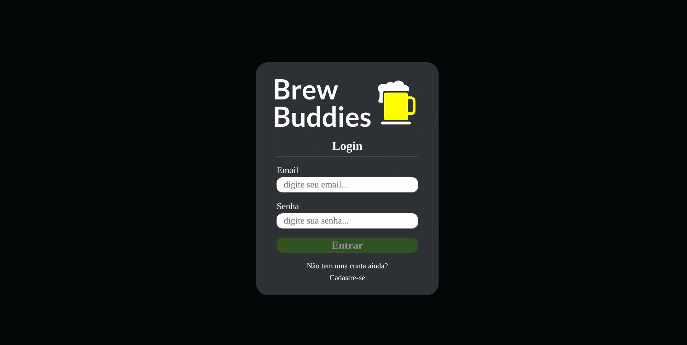

# Brew Buddies


Trata-se de uma aplicação que tem como objetivo provêr agilidade de atendimento via delivery a revendedores de bebidas. Foi desenvolvida como projeto de aprendizado em grupo no curso de desenvolvimento Web [Trybe](https://www.betrybe.com/).

A aplicação se encarrega de autenticar e autorizar os usuários, assim como organizar os pedidos e entregas:
  - O cliente faz o pedido utilizando um "carrinho de compras"
    - O cliente possui as informações detalhadas e se o pedido está sendo preparado ou se já saiu pra entrega
  - O vendedor aprova, prepara e envia esse pedido
    - O vendedor possui as informações detalhadas sobre o pedido
  - Quando o produto é recebido pelo cliente, o mesmo marca o pedido como "recebido"
  - O administrador do sistema possui a capacidade de atribuir o tipo de usuário enquanto cria um novo, assim como remover usuário já cadastrado

⚠️ MySQL deve estar instalado para o funcionamento da API.

⚠️ Utiliza localStorage do browser.

<details>
<summary><strong>Ferraments utilizadas</strong></summary>

- [pm2](https://pm2.keymetrics.io/)

- Front-end:
  - [ReactJS](https://reactjs.org/)
  - [React Router](https://reactrouter.com/en/main)
  - [Axios](https://axios-http.com/docs/intro)
  - [React Testing Library](https://testing-library.com/)
  - [JEST](https://jestjs.io/)
  - SCSS
- Back-end:
  - [NodeJS](https://nodejs.org/en/)
  - [ExpressJS](https://expressjs.com/pt-br/)
  - [Sequelize](https://sequelize.org/)
  - [JSON Web Token](https://www.npmjs.com/package/jsonwebtoken)
  - [Joi](https://joi.dev/)
- Linters:
  - [Eslint](https://eslint.org/)
  - [Stylelint](https://stylelint.io/)

</details>

<details>
  <summary><strong>Pré-visualização</strong></summary>
  <blockquote>
    <details>
      <summary>Login</summary>
      
    </details>
    <details>
      <summary>Registro de usuário</summary>
      
    </details>
    <details>
      <summary>Comprador - Fazendo pedido</summary>
      
    </details>
    <details>
      <summary>Vendedor - Detalhes e interação com pedido</summary>
      
    </details>
    <details>
      <summary>Comprador - Detalhes e interação com pedido</summary>
      
    </details>
    <details>
      <summary>Administrador - Controle de usuários</summary>
      
    </details>
  </blockquote>
</details>

<details>
<summary><strong>Instalação e uso</strong></summary>

1. Clone o repositório e entre na pasta do repositório que você acabou de clonar

```bash
git clone git@github.com:pennaor/delivery-app.git
cd ./delivery-app
```

2. Instale as dependências

```bash
npm install
```

3. Crie um arquivo .env no diretório do back-end ou utilize as configurações default

3. Instale as depedências do front-end/back-end e rode o `Sequelize` no `./back-end` com o script:

```bash
npm run dev:prestart
```

4. Rode a aplicação nas portas `3000` e `3001`:

```bash
npm start
```

5. Acesse `http://localhost:3000`

6. Utilize as credenciais da pessoa administradora para fazer login:

```bash
E-mail: adm@deliveryapp.com
Senha: --adm2@21!!--
```

</details>

<details>
<summary><strong>Scripts principais</strong></summary>

  **Os scripts abaixo são definidos da raiz do projeto (`./package.json`) e não das aplicações individuais `./front-end/package.json` e `./back-end/package.json`**:

  - `start`: Limpa as portas `3000` e `3001`, subindo a aplicação com `pm2` em modo `fork` (uma instância para cada aplicação). Nesse modo, as alterações não são assistidas;
    - *uso (na raiz do projeto): `npm start`*

  - `stop`: Para e deleta as aplicações rodando no `pm2`;
    - *uso (na raiz do projeto): `npm stop`*

  - `dev`: Limpa as portas `3000` e `3001` e sobe a aplicação com `pm2` em modo `fork` (uma instância pra cada aplicação). Nesse modo, as atualizações são assistidas (modo `watch`);
    - *uso (na raiz do projeto): `npm run dev`*

  - `dev:prestart`: A partir da raiz, esse comando faz o processo de instalação de dependências (`npm i`) nos dois projetos (`./front-end` e `./back-end`) e roda o `Sequelize` no `./back-end` (lembrar de configurar o `.env` no mesmo);
    - *uso (na raiz do projeto): `npm run dev:prestart`*

  - `db:reset`: Roda os scripts do `Sequelize` restaurando o **banco de dados de desenvolvimento** (final `-dev`). Utilize esse script caso ocorra algum problema no seu banco local;
    - *uso (na raiz do projeto): `npm run db:reset`*

  - `db:reset:debug`: Roda os scripts do `Sequelize` restaurando o **banco de dados de desenvolvimento** (final `-dev`). Utilize esse script caso ocorra algum problema no seu banco local. Esse comando também é capaz de retornar informações detalhadas de erros (quando ocorrerem no processo);
    - *uso (na raiz do projeto): `npm run db:reset:debug`*

</details>

<details>
<summary><strong>Testes UI Front-end</strong></summary>

Com a aplicação rodando, mude para o diretório do front-end e execute o script:
```bash
cd ./front-end
npm test
```

Para verificar cobertura dos testes, execute o script:
```bash
npm run test:coverage
```

</details>

<details>
<summary><strong>Nosso grupo</strong></summary>

- [Aluisio Penna](https://github.com/pennaor)
- [João E. S. Pacheco](https://github.com/joaoespacheco)
- [Jonathan K.](https://github.com/jonathankarlinski)
- [Lau](https://github.com/laujuu)
- [Magno Gouvêa](https://github.com/magnogouvea)

</details>

<details>
<summary><strong>Trybe</strong></summary>

  São de total autoria da [Trybe](https://www.betrybe.com/):

  - Proposta do projeto
  - Regras de Lint
  - setup pm2
  - npm scripts

</details>
